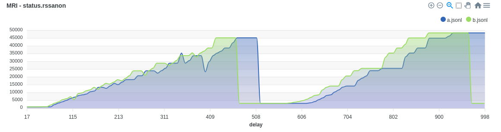

# MRI 🧲🩻👩🏻‍💻

A Simple tool to monitor process resource usage.

Collects statistics from the `/proc` filesystem and saves it where you want.


## Installation

Just download static binary from the [releases](https://github.com/qdrant/mri/releases) page.

```bash
VERSION=v0.1.3 wget https://github.com/qdrant/mri/releases/download/{VERSION}/mri-x86_64-unknown-linux-musl.tar.gz -O mri.tgz ; tar -xzvf mri.tgz
```

## Usage

MRI can monitor a specific PID, or initialize a new process and monitor it.

```bash
./mri -c "python -c '2 ** 100000000'" -a status.rssanon -r stat.utime --jsonl -
```

MRI allows to monitor any of the available fields in the `/proc/{pid}/stat` and `/proc/{pid}/status` filesystem.

Full list can be found here:
 - https://docs.rs/procfs/latest/procfs/process/struct.Status.html
 - https://docs.rs/procfs/latest/procfs/process/struct.Stat.html

MRI can record either absolute values (with `-a` flag) or deltas (with `-r` flag).

### HTML rendering

MRI can also render the collected data as an HTML page.

```bash
./mri -a status.rssanon -r stat.utime --relative-time --html 'test.html' --pid 123 -d 5
```

Produces a page like this:


Generated page is standalone, contains all required data and can be shared with others.
It is, however, depends on the `apexcharts` library, which is included in the page via CDN.


## Options

```
./mri --help
Usage: mri [OPTIONS]

Options:
  -p, --pid <PID>            The PID of the process to monitor
  -c, --command <COMMAND>    Command and arguments to run. Used if the PID is not provided
  -i, --interval <INTERVAL>  The interval between samples in milliseconds [default: 10]
  -d, --duration <DURATION>  The duration of the monitoring in seconds [default: 10]
      --relative-time        Switch time to relative (in milliseconds)
  -a, --absolute <ABSOLUTE>  list of absolute values to display. Example: "status.rssanon"
  -r, --relative <RELATIVE>  list of relative values to display. Example: "stat.stime" The value will be displayed as the difference between the current value and the previous value. The first value will be displayed as 0
      --csv <CSV>            Output path for the CSV file. If "-" is provided, the CSV will be printed to stdout
      --jsonl <JSONL>        Output path for the JSONL file. If "-" is provided, the JSONL will be printed to stdout
      --html <HTML>          Output path for the HTML file
  -h, --help                 Print help
  -V, --version              Print version
```


## Post-processing of the data

`mri` allows you to merge results of multiple runs into a single html with charts.

It is done using the `merge` subcommand. Example:

```bash
./mri merge --jsonl a.jsonl --jsonl b.jsonl --html test.html
```



### Command line options

```bash
Post process the output of previous runs by merging multiple jsonl files into a HTML graph

Usage: mri merge [OPTIONS] --html <HTML>

Options:
      --html <HTML>          The path to the output HTML file
      --jsonl <JSONL>        The path jsonl files to merge
      --cut-to <CUT_TO>      Remove recordings older than the given value
      --cut-from <CUT_FROM>  Remove recordings newer than the given value
      --offset <OFFSET>      Time offset applied for individual files Can specify multiple values, one for each merged file
  -h, --help                 Print help
```
